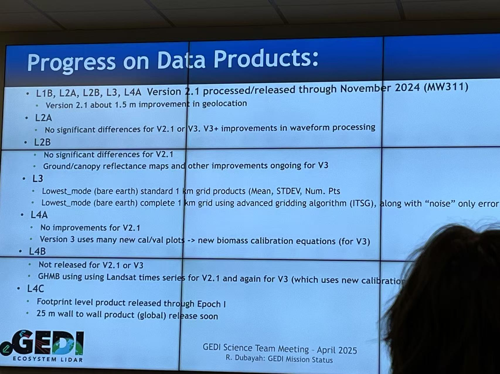

# News

Here are a few announcements coming soon or which have just happened:

- **Project Update, April 2025:** In collaboration with PI Sung-Ching Lee at MPI-BGC ([check his lab here]([https://bgc.iwww.mpg.de/en/bgi/ecomet)), we welcomed Dr. Jiaye Ping as a Humboldt Postdoctoral Fellow. She will join us to investigate the regulation of climate extremes on global carbon uptake and release through our bi-national collaboration between the U.S. and Germany, starting in October 2024!

- **Workshop Update, April 2025:** Together with a graduate student, I participated in a GEDI science team meeting at the University of Maryland, as highly recommended by Prof. Trevor Keenan. The three-day, medium-intensity meeting was fascinating, featuring presentations from distinguished scientists on topics ranging from GEDI-InSAR-Sentinel-2 image fusion, quality filtering algorithm enhancement, and complexity metrics construction to broad applications in vegetation modeling, disturbance assessment, and habitat protection. Last but not least, GEDI V2.1 is coming this summer with improved geolocation. Stay tuned!

- **Preprint Update, March 2025:** The preprint of *Diagnosing Syndromes of Biosphere-Atmosphere-Socioeconomic Change* ([view on arXiv](https://arxiv.org/abs/2503.08874)) was sent out for peer review on *One Earth*. This perspective work offers a data-driven approach for monitoring, integrating, and diagnosing the dynamic interactions among the biosphere, atmosphere, and socioeconomic activities. Under the leadership of Prof. Markus Reinstein and with the support of a broad scientific team, we presented a prototype and summarized the main interactions between natural and urban systems.

